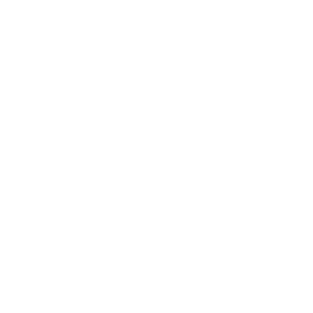

# Cap2Clip

<p align="center">
  
</p>

<p align="center"><strong>Capture and Clip</strong> — a lightweight screenshot and annotation tool for Windows.</p>


## Why Cap2Clip?

- ⚡ **Fast** — Built with Rust + WebView2, launches instantly
- 🎯 **Minimal** — No cloud, no login, no bloat
- ✏️ **Annotate** — Draw, highlight, and add text before saving
- 📋 **Instant** — Copy to clipboard with one click
- 🔧 **Portable** — Works as a standalone `.exe` or MSI installer

## Features

- 📸 **Region Capture** — Drag to select any screen area
- 🖼️ **Full Screen Capture** — Capture entire screen instantly
- ✏️ **Drawing Tools** — Pencil, highlighter, rectangle, ellipse, arrow, line, text
- 🎨 **Color Picker** — Choose any color for your annotations
- 📐 **Dimension Presets** — Save and reuse common screen sizes (16:9, 4:3, 1:1, etc.)
- 💾 **Save & Copy** — Export as PNG or copy directly to clipboard
- ⚙️ **Auto-start** — Launch with Windows (optional)
- 🔄 **Auto-update** — Check for new versions from within the app
- 🖥️ **System Tray** — Access capture from anywhere via system tray icon

## Installation

### Windows

**Option 1: MSI Installer** (recommended for system-wide install)
```
Download: releases/Cap2Clip_1.0.0_x64_en-US.msi
```

**Option 2: NSIS Setup**
```
Download: releases/Cap2Clip_1.0.0_x64-setup.exe
```

**Option 3: Portable**
```
Download: releases/Cap2Clip.exe
```
Run the `.exe` directly — no installation required.

## Keyboard Shortcuts

| Shortcut | Action |
|----------|--------|
| `PrintScreen` | Open region capture |
| `Shift + PrintScreen` | Full screen capture → clipboard |
| `Esc` | Cancel / Close overlay |
| `[` | Decrease brush size |
| `]` | Increase brush size |
| `Ctrl + C` | Copy annotated image to clipboard |
| `Ctrl + S` | Save annotated image to file |

## Annotation Tools

| Tool | Shortcut | Description |
|------|----------|-------------|
| 🔀 **Move** | M | Move the selection frame |
| ✋ **Select** | S | Select and manipulate drawn objects |
| ✏️ **Pen** | P | Freehand drawing |
| 🖍️ **Highlight** | H | Semi-transparent highlighter |
| ▬ **Line** | L | Straight lines |
| ➡️ **Arrow** | A | Arrows |
| ⬜ **Rectangle** | R | Rectangles |
| ⭕ **Ellipse** | E | Ellipses/circles |
| T **Text** | T | Text annotations |

### Tool Tips

- **Move tool (default)** — Click anywhere inside the selection to drag the frame. Cursor changes to resize handles at corners.
- **Color picker** — Click the colored circle in the toolbar to open the color palette.
- **Brush size** — Use `[` and `]` keys to decrease/increase stroke width.

## Presets

Dimension presets let you quickly create captures with exact aspect ratios or sizes.

### Built-in Presets

| Name | Type | Description |
|------|------|-------------|
| Free / Custom | Free | Drag to any size |
| 1:1 | Aspect Ratio | Square |
| 4:3 | Aspect Ratio | Classic monitor |
| 3:4 | Aspect Ratio | Portrait |
| 16:9 | Aspect Ratio | Widescreen |
| 9:16 | Aspect Ratio | Mobile portrait |
| 21:9 | Aspect Ratio | Ultrawide |

### Custom Presets

You can add your own presets in **Settings**:
1. Click the system tray icon → Settings
2. Go to **Settings → Presets** tab
3. Enter a name, choose type (Fixed Size or Aspect Ratio), and dimensions
4. Click **Add**

## Blur / Pixelate roadmap

The blur tool is currently **not production-ready**. The current UI exposes the intended brush modes, but exported images do not yet reliably apply a real pixel-level blur or mosaic effect. Do not use it as the only protection for sensitive information.

### First realistic milestone

1. Record each blur stroke as a path with brush mode, width, and bounds.
2. Render the selected screenshot into an off-screen canvas.
3. Rasterize the path into a mask, expand it by the brush radius, and process only masked pixels.
4. Implement Gaussian blur and deterministic pixelation as separate compositing passes.
5. Composite normal annotations above the processed image.
6. Add automated export tests for diagonal, horizontal, short, and overlapping strokes.

### Later milestones

- Preview the exact export result while editing.
- Support undo/redo and multi-region export without losing blur paths.
- Add configurable blur strength and pixel block size.
- Verify transparent/HiDPI screenshots and benchmark large captures.

Until these milestones are complete, use the solid mask mode for sensitive data.

## Development

### Prerequisites

- Node.js 18+
- Rust 1.75+
- Windows SDK (for building on Windows)

### Quick Start

```bash
# Clone the repository
git clone https://github.com/Thucht/Cap2Clip.git
cd cap2clip

# Install dependencies
npm install

# Run in development mode
npm run tauri dev

# Build for production
npm run tauri build
```

### Project Structure

```
cap2clip/
├── src/                          # React frontend
│   ├── components/
│   │   ├── AnnotationCanvas.tsx  # Fabric.js canvas for drawing
│   │   ├── AnnotationToolbar.tsx # Horizontal + vertical toolbars
│   │   ├── CaptureOverlay.tsx    # Selection + overlay UI
│   │   ├── SettingsPanel.tsx     # Settings UI
│   │   └── icons.tsx             # SVG icon components
│   ├── App.tsx                   # Main app component
│   └── styles/
│       └── global.css            # All styles
├── src-tauri/                    # Rust backend
│   ├── src/
│   │   ├── main.rs              # Entry point, tray, shortcuts
│   │   ├── capture.rs           # Screenshot capture logic
│   │   ├── clipboard.rs         # Clipboard operations
│   │   └── settings.rs          # Settings persistence
│   ├── icons/                   # App icons
│   ├── Cargo.toml
│   └── tauri.conf.json
├── releases/                     # Built executables & installers
├── SPEC.md                       # Detailed specification
├── README.md
└── package.json
```

### Tech Stack

- **Frontend**: React 18, TypeScript, Vite, Fabric.js
- **Backend**: Rust, Tauri v2
- **Screenshot**: `screenshots` crate
- **Clipboard**: `arboard` crate
- **Registry** (Windows): `winreg` crate

## Configuration

Settings are stored in:
- **Windows**: `%APPDATA%/cap2clip/settings.json`
- **macOS**: `~/Library/Application Support/cap2clip/settings.json`

### Settings Fields

```json
{
  "shortcut_region": "PrintScreen",
  "shortcut_fullscreen": "Shift+PrintScreen",
  "shortcut_copy": "Ctrl+C",
  "shortcut_save": "Ctrl+S",
  "shortcut_cancel": "Escape",
  "shortcuts_enabled": true,
  "last_save_dir": "C:\\Users\\You\\Pictures\\Screenshots",
  "previous_selection": null,
  "presets": [...],
  "auto_start": false
}
```

## Known Issues

- System tray left-click behavior varies by OS
- Transparent window requires WebView2 runtime (Windows)

## Contributing

Contributions welcome! Please open an issue first to discuss what you'd like to change.

## License

MIT — see [LICENSE](LICENSE) file.
